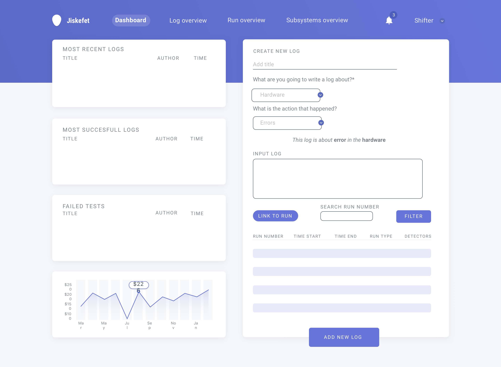

# jiskefet app



[Json server for prototyping](https://github.com/typicode/json-server#getting-started)

to start the fake api database
```
cd into fakeApi
json-server --watch db.json
```
to generate new dataset
```
cd into fakeApi
node data.js
```

data.js generates a json file based on the object created in data.js
the json-server package generates automatically different routes (POST, PUT etc) for Json files.
